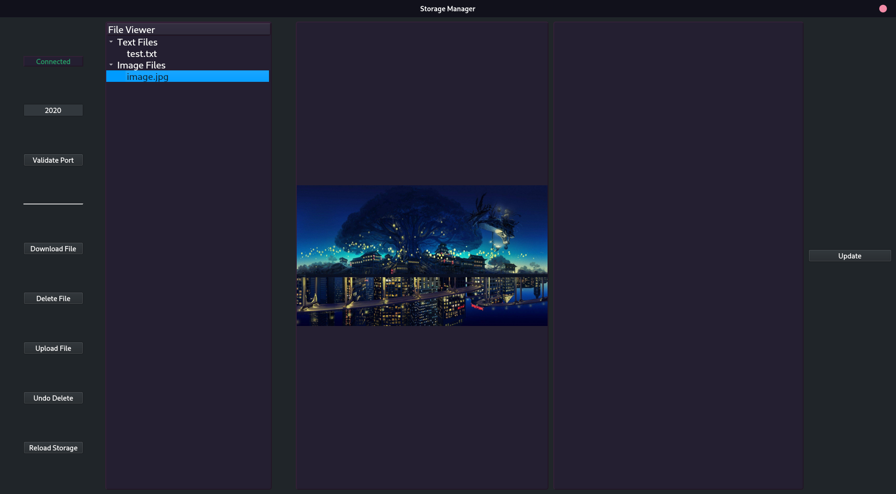
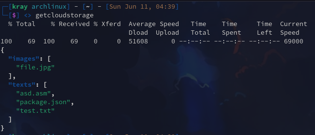

# Cloud-Storage-System
A Cloud Storage System with a REST API and a Qt application to perform CRUD operations on the cloud storage.

The files inside the API in the storage are just test files to perform operations, they are not necessary.

UI:

Bash script example:

Bash commands:

``~$ download <file> <where>`` Downloads the specified file in the specified path, defaults to the current directory if path is not specified.

``~$ delete <file>`` Delete the specified file in the cloud storage.

``~$ upload <file>`` Uploads the specified file to the cloud storage.

``~$ getcloudstorage`` Returns a formatted JSON with the storage content.
