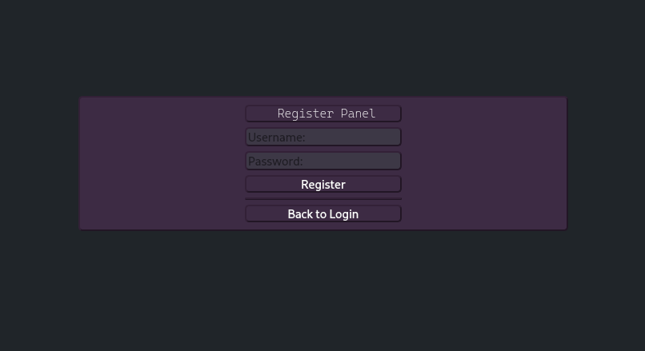

# Cloud-Storage-System
A Cloud Storage System with a REST API and a Qt application to perform CRUD operations on the cloud storage.
It has a login/register system and the requests work with tokens given when login.

The files inside the API in the storage are just test files to perform operations, they are not necessary.

## UI:
### Main Panel

### Admin Panel

### Register panel

### Login Panel

